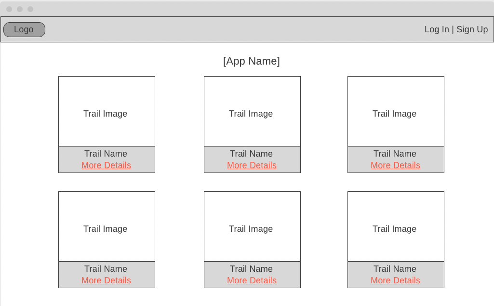
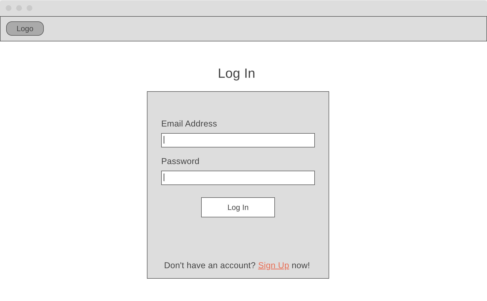
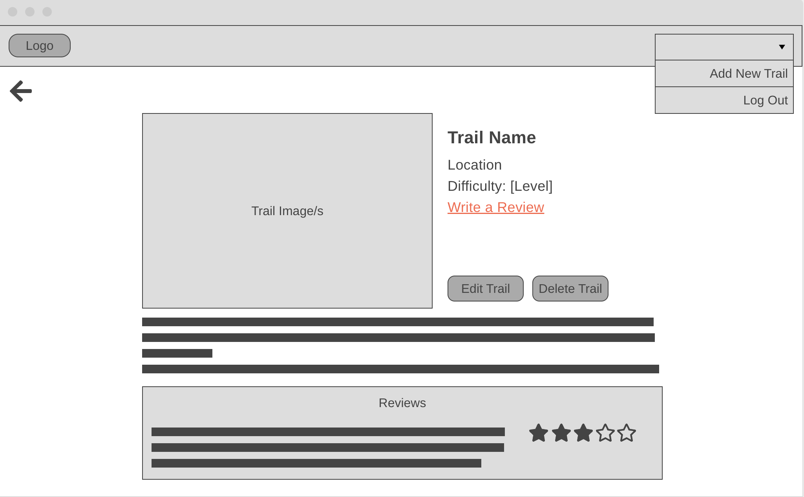

### Your group members
- Hasini Rajasinghe
- Catalina Espinoza
- Jasmine VanExel
- Caroline Clark

### Your project idea 
An app for outdoor enthusiasts to view and manage hiking/biking trails. 

### List of models and their properties
    Trail Schema:
        name: String
        location: String
        difficulty: Number
        length: Number
        elevationChange: Number
        routeType: String
        description: String
        image: String
        cloudinary_id: String
        reviews: mongoose.Schema.Types.ObjectId, ref: ‘Review’

    User Schema:
        name: String
        email: String
        googleID: String
        reviews: mongoose.Schema.Types.ObjectId, ref: ‘Review’

    Review Schema:
        content: String
        rating: Number
        userID: mongoose.Schema.Types.ObjectId, ref: ‘User’
        trailID: mongoose.Schema.Types.ObjectId, ref: 'Trail'

### List of routes
Method | Route | Description 
--- | --- | --- 
GET | /trails/ | Show all Hikes (index)
GET | /trails/:id | Display hike details by ID (show)
GET | /trails/new | Show form to add a new hike (new)
POST | /trails | Create a new hike in the DB (create)
GET | /trails/:id/edit | Show form to edit a hike (edit)
PUT | /trails/:id | Update hike entry in the DB (update)
DELETE | /trails/:id | Delete a hike from the DB (delete)

Method | Route | Description 
--- | --- | --- 
POST | /trails/:id/reviews | Submit New review (create)
DELETE | /trails/:id/reviews/:id | Delete review by ID (delete)

Method | Route | Description 
--- | --- | --- 
GET | /login | Asks user to sign in using credentials
GET | /logout | User logs out
GET | /signup | User can sign up

### Scrum manager/project manager's name
Caroline Clark

### User stories - MVP
- As a user, I would like to view local hiking trails.
- As a user, I would like to view details of local hiking trails.
- As a user, I would like to have the option to signup/login.
- As a logged in user, I'd like to edit hikes.
- As a logged in user, I'd like to add new hikes.
- As a logged in user, I'd like to delete hikes.
- As a logged in user, I would like to add reviews of trails.
- As a user, I'd like to see photos of the hikes.

### User stories - Stretch 
- As a user, I'd like to login using Google, Facebook, or Twitter.
- As a logged in user, I would like to bookmark trails and view my favorites.
- As a user, I'd like to see a wide variety of trails in the database. 
- As a user, if I don't have a photo, I'd like there to be a default photo populated when I create a new entry.
- As a user, I'd like the ability to filter hikes by location, difficulty, and possibly other attributes.
- As a user, I would like to see the weather for hiking locations. 
- As a user, I would like to setup a profile with my name, location, photo, and reviews.

### Wireframes

